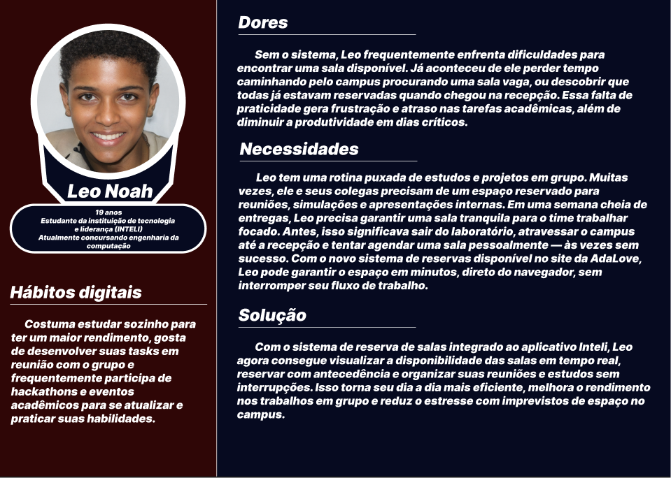
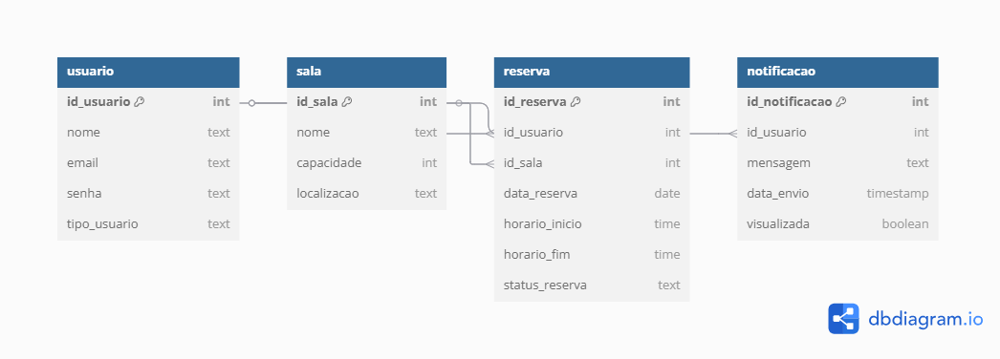
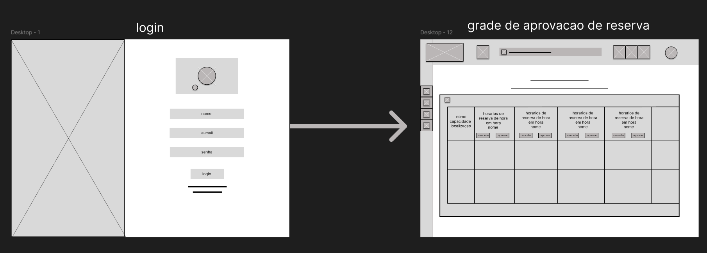
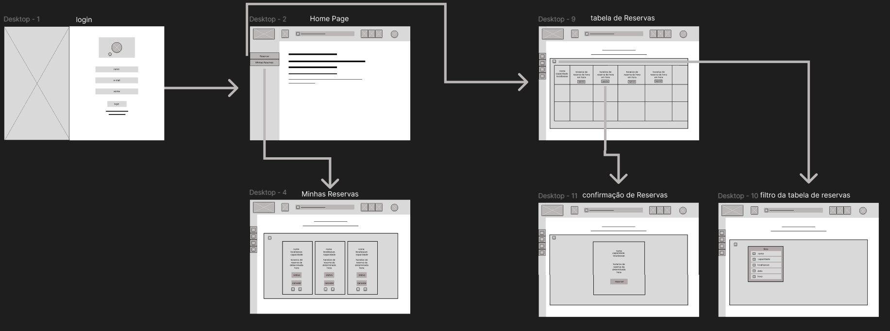
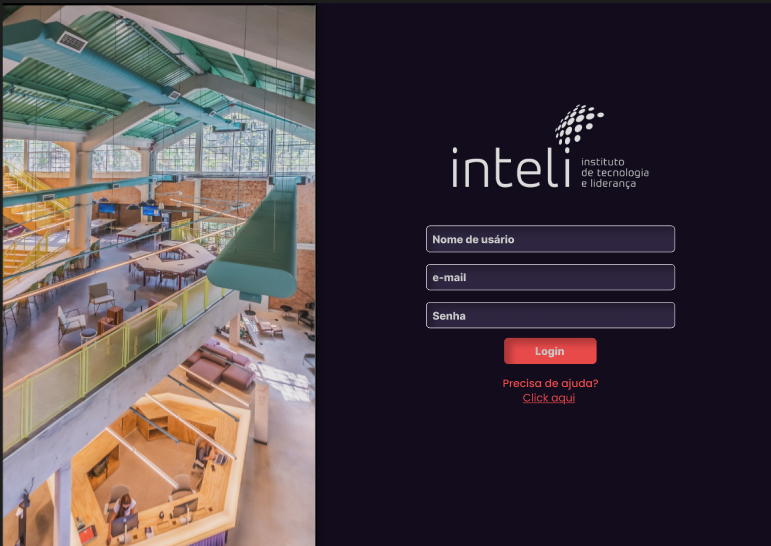
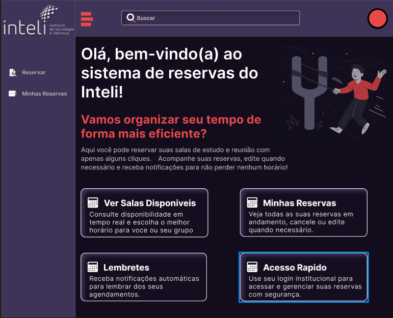
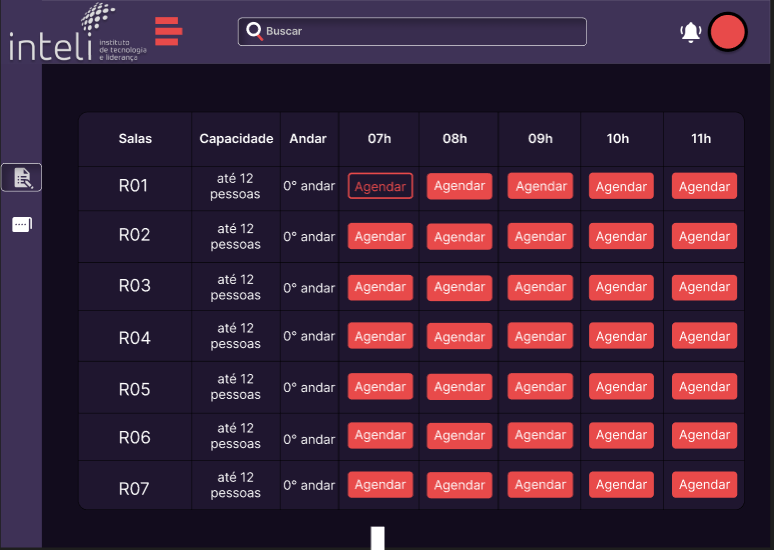

# Web Application Document - Projeto Individual - Módulo 2 - Inteli

## Sistema de Reserva de Salas - Plataforma Web (AdaLove).

#### **Autor:** Arthur Marques de Almeida

## Sumário

1. [Introdução](#c1)  
2. [Visão Geral da Aplicação Web](#c2)  
3. [Projeto Técnico da Aplicação Web](#c3)  
4. [Desenvolvimento da Aplicação Web](#c4)  
5. [Referências](#c5)  

<br>

## <a name="c1"></a>1. Introdução 
# Descrição do Projeto

O projeto consiste no desenvolvimento de um **sistema de reserva de salas** acessível via **plataforma web**, integrado ao site institucional **AdaLove**, da faculdade **Inteli**. A proposta busca ampliar a autonomia e facilitar o dia a dia dos alunos e professores, oferecendo um meio simples, digital e acessível para agendar as diversas mini salas de estudo e reuniões disponíveis no campus.

Atualmente, o processo de reserva ocorre exclusivamente de forma presencial, na recepção da faculdade, o que gera baixa visibilidade da disponibilidade das salas e acaba dificultando a organização dos alunos e professores que precisam desses espaços. Muitos sequer sabem que é necessário fazer reserva.

O novo sistema terá como base uma **interface web intuitiva**, com login institucional, onde o usuário poderá:

- Visualizar a lista de salas e horários disponíveis em tempo real;
- Realizar reservas de forma rápida e prática;
- Consultar, editar ou cancelar suas próprias reservas;
- Receber notificações e lembretes (via painel do usuário);
- (Para administradores) Acompanhar e gerenciar o uso dos espaços.

Ao estar disponível diretamente no site **AdaLove**, o sistema se torna mais acessível para toda a comunidade acadêmica, sem a necessidade de baixar ou atualizar um app. Além disso, facilita a manutenção técnica e a integração com outros sistemas já existentes da faculdade.

Essa mudança fortalece o propósito do **Inteli** de promover soluções digitais acessíveis, otimizando a gestão dos espaços físicos do campus e tornando o ambiente acadêmico mais organizado, eficiente e centrado no usuário.


---

## <a name="c2"></a>2. Visão Geral da Aplicação Web

<div align="center">
  <sub>Persona</sub><br>
  
</div>

### 2.2. User Stories 

**(US01)**  
Como aluno, quero visualizar a lista de salas disponíveis para reserva, para escolher uma sala livre que atenda às minhas necessidades.

**(US02)**  
Como professor, quero realizar a reserva de uma sala diretamente pelo site da Adalove, para garantir um espaço adequado para ministrar aulas extras, reuniões ou atividades acadêmicas.

**(US03)**  
Como aluna, quero receber notificações de confirmação e lembrete das minhas reservas, para não esquecer dos horários e gerenciar melhor meu tempo.

**(US04)**  
Como administrador da faculdade, quero gerenciar (aprovar, cancelar ou alterar) reservas feitas pelos alunos, para manter o controle do uso das salas e resolver conflitos de agendamento.

## Analise INVEST do US02 (professor)
**(US02)**  
Como professor, quero realizar a reserva de uma sala diretamente pelo site da Adalove, para garantir um espaço adequado para ministrar aulas extras, reuniões ou atividades acadêmicas.

**I (Independente):**
Pode ser implementada separadamente das outras funcionalidades, como visualização de salas ou envio de notificações.

**N (Negociável):**
A forma como o professor realiza a reserva (ex: escolha de tipo de sala, aprovação automática ou manual) pode ser ajustada de acordo com as necessidades da faculdade.

**V (Valiosa):**
Permite que o professor tenha autonomia para planejar atividades acadêmicas sem depender do atendimento presencial, agilizando processos e otimizando o uso dos espaços.

**E (Estimável):**
A funcionalidade é bem definida (escolher sala, data, horário, quem estará presente, confirmar reserva) e pode ser facilmente estimada em termos de esforço de desenvolvimento.

**S (Small - Pequena):**
É pequena o bastante para ser desenvolvida e entregue em uma sprint de duração padrão, principalmente se focar inicialmente em um fluxo simples de reserva.

**T (Testável):**
Pode ser testada facilmente, verificando se o professor consegue selecionar uma sala e completar uma reserva pelo site da Adalove.

---

## <a name="c3"></a>3. Projeto da Aplicação Web

### 3.1. Modelagem do banco de dados  (Semana 3)

O modelo de tabelas foi projetado para suportar as funcionalidades do sistema de reservas de salas da plataforma AdaLove. Ele contempla usuários com diferentes perfis, controle de reservas e envio de notificações. A estrutura garante integridade e facilidade de gestão dos dados.

<div align="center">
  <sub>Persona</sub><br>
  
</div>

**O sistema é composto por quatro entidades principais:**

1. Usuário  
Representa todos os usuários cadastrados na plataforma, podendo ter o tipo aluno, professor ou administrador.
2. Sala  
Define as salas disponíveis para reserva, com nome, capacidade e localização.
3. Reserva  
Representa os agendamentos feitos por usuários para uma determinada sala, data e horário.
4. Notificação  
Controla os lembretes e confirmações enviados aos usuários.

A seguir está o código SQL utilizado para criação das tabelas no Supabase/PostgreSQL:

```sql
-- Tabela: usuario
CREATE TABLE IF NOT EXISTS usuario (
  id_usuario SERIAL PRIMARY KEY,
  nome TEXT NOT NULL,
  email TEXT UNIQUE NOT NULL,
  senha TEXT NOT NULL,
  tipo_usuario TEXT NOT NULL CHECK (tipo_usuario IN ('aluno', 'professor', 'admin'))
);

-- Tabela: sala
CREATE TABLE IF NOT EXISTS sala (
  id_sala SERIAL PRIMARY KEY,
  nome TEXT NOT NULL,
  capacidade INT NOT NULL,
  localizacao TEXT NOT NULL
);

-- Tabela: reserva
CREATE TABLE IF NOT EXISTS reserva (
  id_reserva SERIAL PRIMARY KEY,
  id_usuario INT NOT NULL REFERENCES usuario(id_usuario),
  id_sala INT NOT NULL REFERENCES sala(id_sala),
  data_reserva DATE NOT NULL,
  horario_inicio TIME NOT NULL,
  horario_fim TIME NOT NULL,
  status_reserva TEXT NOT NULL DEFAULT 'pendente' CHECK (status_reserva IN ('pendente', 'aprovada', 'cancelada')),
  CHECK (horario_inicio < horario_fim)
);

-- Tabela: notificacao
CREATE TABLE IF NOT EXISTS notificacao (
  id_notificacao SERIAL PRIMARY KEY,
  id_usuario INT NOT NULL REFERENCES usuario(id_usuario),
  mensagem TEXT NOT NULL,
  tipo_notificacao TEXT NOT NULL,
  id_reserva INT REFERENCES reserva(id_reserva),
  data_envio TIMESTAMP DEFAULT CURRENT_TIMESTAMP,
  visualizada BOOLEAN DEFAULT FALSE
);

-- Tabela: administrador_acao
CREATE TABLE IF NOT EXISTS administrador_acao (
  id_acao SERIAL PRIMARY KEY,
  id_admin INT NOT NULL REFERENCES usuario(id_usuario),
  id_reserva INT NOT NULL REFERENCES reserva(id_reserva),
  acao TEXT NOT NULL CHECK (acao IN ('aprovou', 'cancelou')),
  data_acao TIMESTAMP DEFAULT CURRENT_TIMESTAMP
);
```

### 3.1.1 BD e Models (Semana 5)
1. Usuario

Responsável por representar os usuários do sistema (aluno, professor ou administrador). Os dados são armazenados na tabela `usuario`.

- **Campos:**
  - `id_usuario`: identificador único (chave primária)
  - `nome`: nome do usuário
  - `email`: endereço institucional (único)
  - `senha`: senha criptografada
  - `tipo_usuario`: define o tipo de usuário (`aluno`, `professor` ou `admin`)

- **Principais métodos:**
  - `criar({ nome, email, senha, tipo_usuario })`
  - `buscarPorEmail(email)`
  - `buscarPorId(id)`
  - `listarTodos()`

---

### 2. Sala

Modela as mini salas disponíveis para reserva, com suas características e localização.

- **Campos:**
  - `id_sala`: identificador único da sala
  - `nome`: nome da sala (ex: R01, S02)
  - `capacidade`: número máximo de pessoas
  - `localizacao`: andar da sala (ex: “0° andar”)

- **Principais métodos:**
  - `listarTodas()`
  - `buscarPorId(id_sala)`

---

### 3. Reserva

Gerencia as reservas feitas pelos usuários, incluindo horários e status. Também realiza validações de conflitos de horário.

- **Campos:**
  - `id_reserva`
  - `id_usuario` (FK)
  - `id_sala` (FK)
  - `data_reserva`
  - `horario_inicio`
  - `horario_fim`
  - `status_reserva`: `pendente`, `aprovada`, `cancelada`

- **Principais métodos:**
  - `criar({ id_usuario, id_sala, data_reserva, horario_inicio, horario_fim })`
  - `listarPorUsuario(id_usuario)`
  - `listarTodasComJoin()`
  - `atualizarStatus(id, status)`
  - `verificarConflito(id_sala, data, início, fim)`

---

### 4. Notificacao

Modela notificações que informam usuários sobre mudanças de status nas reservas.

- **Campos:**
  - `id_notificacao`
  - `id_usuario` (FK)
  - `mensagem`
  - `tipo_notificacao`: ex: `reserva_aprovada`, `reserva_cancelada`
  - `id_reserva` (opcional, FK)
  - `data_envio`
  - `visualizada` (boolean)

- **Principais métodos:**
  - `create({ id_usuario, tipo_notificacao, mensagem, id_reserva })`
  - `findByUsuario(id_usuario)`
  - `findById(id)`
  - `marcarComoVisualizada(id_notificacao)`

---

### 5. AdministradorAção

Controla o histórico de ações administrativas sobre as reservas.

- **Campos:**
  - `id_acao`
  - `id_admin` (FK)
  - `id_reserva` (FK)
  - `acao`: `aprovou` ou `cancelou`
  - `data_acao`

- **Principais métodos:**
  - `criar({ id_admin, id_reserva, acao })`

---

Esses models foram implementados no diretório `/repositories/`, promovendo separação entre a lógica de negócio e a camada de persistência. Todos os acessos ao banco de dados passam por esses arquivos, garantindo um código mais modular, reutilizável e fácil de testar.

### 3.2. Arquitetura (Semana 5)

<div align="center">
  <sub>Diagrama de Arquitetura</sub><br>
  
</div>

### **Views**
Arquivos `.ejs` localizados na pasta `views/`. São responsáveis por exibir o conteúdo ao usuário e coletar dados através de formulários. Cada página representa uma funcionalidade específica:
- `login.ejs`: entrada de credenciais de acesso.
- `cadastro.ejs`: criação de novos usuários (com seleção de perfil).
- `home.ejs`: acesso ao sistema e navegação principal.
- `reservar.ejs`: exibe lista de salas e permite selecionar data e horário para reservar.
- `minhasReservas.ejs`: mostra ao usuário as suas reservas e permite cancelamento.
- `adminDashboard.ejs`: painel exclusivo para administradores aprovarem ou cancelarem reservas.

---

### **Controllers**
Os controllers recebem requisições HTTP, processam os dados recebidos, fazem as chamadas aos repositórios e retornam respostas (normalmente uma renderização de uma view com dados). Também controlam a lógica de sessão e autenticação:
- `usuarioController.js`: responsável por cadastro, login e listagem de usuários.
- `reservaController.js`: gerencia criação, listagem e atualização de status das reservas.
- `notificacaoController.js`: manipula notificações (listar, enviar e marcar como visualizadas).
- `adminController.js`: registra ações administrativas como aprovações de reservas.

---

### **Repositories**
Camada que interage diretamente com o banco de dados PostgreSQL (via Supabase). Os repositórios encapsulam todas as queries SQL e são invocados pelos controllers:
- `usuarioRepository.js`
- `reservaRepository.js`
- `notificacaoRepository.js`
- `salaRepository.js`
- `administradorAcaoRepository.js`

---

### **Models**
Os models descrevem a estrutura das entidades utilizadas no banco e são usados como referência para desenvolvimento, testes e documentação. No projeto atual, os models estão organizados como objetos JS nas seguintes entidades:
- `usuario`
- `reserva`
- `notificacao`
- `sala`
- `administrador_acao`

---

### **Banco de Dados**
O banco de dados é hospedado no **Supabase** e contém as seguintes tabelas:
- `usuario`: armazena nome, email, senha e tipo de perfil (admin/aluno/professor).
- `reserva`: dados sobre agendamento de salas (data, horário, status, usuário, sala).
- `sala`: dados estruturais das salas cadastradas (nome, capacidade, localização).
- `notificacao`: mensagens relacionadas a aprovações ou rejeições de reservas.
- `administrador_acao`: log das ações executadas por administradores.

---

##  Resumo dos Fluxos Principais

### **Login e Cadastro**
Usuário acessa `login.ejs` ou `cadastro.ejs`, envia os dados que são processados por `usuarioController.js`, validados e persistidos via `usuarioRepository.js`. A sessão do usuário é iniciada automaticamente após o login.

---

### **Reserva de Salas**
Usuário acessa `reservar.ejs`, seleciona sala, data e horário. `reservaController.js` valida os dados, verifica conflito de horário via `reservaRepository.js`, e se estiver tudo certo, cria a reserva com status "pendente". A reserva aparece na tela `minhasReservas.ejs`.

---

### **Minhas Reservas**
Na página `minhasReservas.ejs`, o usuário visualiza todas as suas reservas e pode cancelar alguma delas. O cancelamento altera o status da reserva via `reservaController.js` e atualiza o banco através de `reservaRepository.js`.

---

### **Painel Administrativo**
Exclusivo para usuários do tipo "admin". Ao acessar `adminDashboard.ejs`, todas as reservas pendentes são carregadas via `reservaController.js`. Cada linha tem dois botões: **aprovar** ou **cancelar**. A decisão é salva no banco e registrada via `administradorAcaoRepository.js`.

---

### **Notificações**
Ao aprovar ou rejeitar reservas, o `notificacaoController.js` cria notificações para os usuários envolvidos. Na tela de notificações (não exibida separadamente), o usuário pode visualizar ou marcar como lidas. Tudo isso é feito com base em `notificacaoRepository.js`.

### 3.3. Wireframes (Semana 03)

<div align="center">
    <sub>Wireframe Fluxo do Usuário</sub><br>
    <br>
    <a href="https://www.figma.com/design/2UVmkvQp59TqM8lI4yCnOM/Untitled?node-id=0-1&m=dev&t=2f3UpjqqJatKLPja-1" target="_blank">
      <sup>Link Figma</sup></a>
      <br>
      <sup> O wireframe apresenta o fluxo do sistema de reservas da plataforma Adalove, permitindo que alunos e professores realizem login, visualizem a lista de salas disponíveis e filtrem por critérios como data, bloco e capacidade. Através da tabela de reservas, o usuário escolhe um horário e confirma a reserva. A tela “Minhas Reservas” exibe agendamentos futuros com opções de cancelamento. Além disso, o sistema envia notificações de confirmação e lembrete, facilitando o controle dos compromissos acadêmicos.</sup>
</div>
  

<div align="center">
  <sub>Wireframe Fluxo do Administrador</sub><br>
  <br>
  <a href="https://www.figma.com/design/2UVmkvQp59TqM8lI4yCnOM/Untitled?node-id=0-1&m=dev&t=2f3UpjqqJatKLPja-1" target="_blank">
    <sup>Link Figma</sup>
  </a><br>
  <sup>O wireframe apresenta a interface destinada à área administrativa do sistema de reservas da faculdade. Após realizar login com nome, e-mail e senha, o administrador é direcionado para uma tela de gerenciamento das solicitações de reserva de salas. Nessa grade, são exibidas todas as reservas feitas pelos alunos, organizadas por horário e sala, com os respectivos dados dos solicitantes. A funcionalidade central dessa interface permite ao administrador aprovar, cancelar ou alterar reservas diretamente da tabela, oferecendo uma visão consolidada que facilita o controle da ocupação dos espaços e a resolução de possíveis conflitos de agendamento.</sup>
</div>

### 3.4. Guia de estilos (Semana 05)

O guia de estilos do sistema **Checkin Room** define um conjunto de componentes visuais, tipografias, cores e ícones com o objetivo de garantir uma identidade visual consistente, moderna e acessível em todas as páginas da aplicação.

<div align="center">
  <sub>Guia de estilos</sub><br>
  
</div>

##  Tipografia

A hierarquia tipográfica segue os padrões estabelecidos na seção **Typography**, com variações de peso e tamanho para indicar títulos, subtítulos e textos auxiliares. Isso contribui para a escaneabilidade e a leitura rápida das informações nas interfaces.

- `h1` até `h6` são utilizados conforme o nível de importância textual.
- Títulos principais utilizam fonte destacada (h1 a h2) em roxo escuro (`#3F3357`).
- Títulos de seções, subtítulos ou legendas de campos seguem a sequência de peso e cor.

##  Paleta de Cores

As cores foram escolhidas para transmitir modernidade, funcionalidade e acessibilidade:

- **`#E84A4A` (vermelho):** botões de *cancelar*, *agendar* e indicar status de *rejeitada*.
- **`#3118EF` (azul):** indica status do tipo de usuário *aluno*.
- **`#18A135` (verde):** indica status *confirmada* ou ações de aprovação.
- **`#8E6821` (amarelo queimado):** indica usuário do tipo *professor*.
- Tons neutros como `#3F3357`, `#261B38`, `#120C1D` e `#FFFFFF` são usados em fundo, textos, bordas e estrutura visual da interface.

##  Ícones

Os ícones foram padronizados para facilitar a navegação e compreensão da interface, com significados claros:

- ☰ Ícone de **menu sanduíche**: alterna a *sidebar lateral*.
- 🔔 Ícone de **sino**: acessa as *notificações*.
- 📚 Ícone de **notas**: leva à tela de *reservas*.
- 📁 Ícone de **pasta**: leva à tela de *minhas reservas*.

Esses ícones estão presentes na navegação lateral e seguem o mesmo padrão visual do restante da aplicação, respeitando a hierarquia visual e a harmonia de cores.

##  Ilustrações

As ilustrações utilizadas seguem uma linha visual institucional e tecnológica. São usadas pontualmente na home e em páginas chave para humanizar a interface e reforçar o vínculo com o ambiente físico do Inteli.

---

Este guia de estilos deve ser consultado sempre que novos componentes forem criados ou alterados, garantindo consistência na experiência do usuário e coerência com a identidade visual do sistema **Checkin Room**.


### 3.5. Protótipo de alta fidelidade (Semana 05)

##  Protótipo de Alta Fidelidade

Abaixo estão algumas telas ilustrativas do sistema **Checkin Room**, demonstrando a experiência do usuário durante o uso da plataforma. Cada tela foi desenvolvida com base em princípios de clareza, acessibilidade e fluidez de navegação.

---

###  Tela de Login

<div align="center">
  <sub>Tela de Login</sub><br>
  
</div>

Essa é a porta de entrada do sistema. Aqui, o usuário preenche seu e-mail institucional e senha para acessar a plataforma. A interface é dividida em duas partes: uma visual com a foto do ambiente real da instituição (à esquerda) e o formulário de acesso (à direita), reforçando a identidade do Inteli.

---

###  Tela Home (Pós-Login)

<div align="center">
  <sub>Tela Home</sub><br>
  
</div>

Após o login, o usuário é direcionado para a tela principal do sistema. Nela, ele encontra quatro opções principais:
- **Ver Salas Disponíveis**: direciona para a tela de agendamento.
- **Minhas Reservas**: exibe todas as reservas que o usuário já fez.
- **Lembretes**: acesso às notificações recebidas.
- **Acesso Rápido**: reforça a importância do login institucional para segurança.

A interface inclui também um campo de busca e ícones de menu lateral para facilitar a navegação.

---

###  Tela de Reservar Salas

<div align="center">
  <sub>Tela de Reservar Salas</sub><br>
  
</div>

Esta tela apresenta uma tabela com a listagem das salas disponíveis, suas capacidades, andares e horários. O botão **"Agendar"** aparece nas células correspondentes aos horários livres, permitindo que o usuário selecione o melhor horário para reserva.

---

###  Tela Minhas Reservas

<div align="center">
  <sub>Tela Minhas Reservas</sub><br>
  
</div>

Aqui o usuário visualiza todas as reservas feitas por ele. Cada cartão mostra a sala, horário e status atual da reserva (ex: confirmada, cancelada ou finalizada). É possível cancelar reservas ainda pendentes diretamente por essa tela.

---

###  Tela Painel do Administrador

<div align="center">
  <sub>Tela Painel do Administrador</sub><br>
  
</div>

Visível apenas para usuários com permissão de administrador. Essa tela exibe todas as reservas realizadas no sistema. O administrador pode aprovar ou rejeitar diretamente as solicitações de reserva e visualizar detalhes como nome do usuário, prioridade (aluno ou professor) e horários.

---

###  Link do Protótipo Completo

[🔗 Acesse o protótipo completo no Figma](https://www.figma.com/design/2UVmkvQp59TqM8lI4yCnOM/Untitled?node-id=68-412&t=pmopyoE3rDJkOYhA-1) <!-- substitua com o link público do seu protótipo -->


## 3.6. WebAPI e Endpoints (Semana 05)

A seguir estão descritos todos os endpoints implementados na API web do sistema **Checkin Room**. Esses endpoints permitem interações como login, cadastro, agendamento de salas, visualização de reservas e administração.

---

###  Autenticação de Usuário

#### `POST /login`
- **Descrição**: Realiza o login de um usuário com e-mail e senha.
- **Body**:
```json
{
  "email": "usuario@sou.inteli.edu.br",
  "senha": "********"
}
```
- **Resposta**: Redireciona para `/home`.

#### `POST /usuarios`
- **Descrição**: Cadastra um novo usuário no sistema.
- **Body**:
```json
{
  "nome": "Usuário Exemplo",
  "email": "usuario@sou.inteli.edu.br",
  "senha": "********",
  "tipo_usuario": "aluno"
}
```
- **Resposta**: Redireciona para a tela de login.

---

###  Usuários

#### `GET /usuarios`
- **Descrição**: Lista todos os usuários cadastrados (uso administrativo).
- **Resposta**: JSON com a lista de usuários.

#### `GET /usuarios/:id`
- **Descrição**: Busca detalhes de um usuário pelo ID.
- **Resposta**: JSON com os dados do usuário.

---

###  Reservas

#### `GET /reservar`
- **Descrição**: Exibe a interface de reservas com listagem de salas e horários disponíveis.

#### `POST /reservas`
- **Descrição**: Cria uma nova reserva para uma sala.
- **Body**:
```json
{
  "id_sala": 3,
  "data_reserva": "2025-05-25",
  "horario_inicio": "14:00",
  "horario_fim": "15:00"
}
```
- **Resposta**: Redireciona para `/reservas/:id_usuario/minhas`.

#### `GET /reservas/:id_usuario/minhas`
- **Descrição**: Lista todas as reservas feitas por um usuário específico.

#### `GET /reservas`
- **Descrição**: Lista todas as reservas do sistema (uso do administrador).

#### `PUT /reservas/:id/aprovar`
- **Descrição**: Aprova uma reserva (admin).
- **Resposta**: Atualiza status e recarrega a tela de administração.

#### `PUT /reservas/:id/cancelar`
- **Descrição**: Cancela uma reserva (usuário ou admin).

---

###  Notificações

#### `GET /notificacoes/:id_usuario`
- **Descrição**: Lista todas as notificações enviadas ao usuário.

#### `PUT /notificacoes/:id`
- **Descrição**: Marca uma notificação como visualizada.

---

###  Extras

#### `GET /admin`
- **Descrição**: Acessa o painel do administrador com todas as reservas pendentes para aprovação ou rejeição.

#### `GET /home`
- **Descrição**: Página inicial pós-login com atalhos para reservas, lembretes e ações rápidas.

---

### 3.7 Interface e Navegação (Semana 07)

*Descreva e ilustre aqui o desenvolvimento do frontend do sistema web, explicando brevemente o que foi entregue em termos de código e sistema. Utilize prints de tela para ilustrar.*

# 3.7 Interface e Navegação

## Visão Geral do Frontend

O frontend do sistema **Checkin Room** foi desenvolvido utilizando **EJS (Embedded JavaScript)** como template engine, **CSS3** para estilização e **JavaScript vanilla** para interatividade. A arquitetura segue o padrão **MVC (Model-View-Controller)**, onde as views são responsáveis pela apresentação e interface do usuário.

## Tecnologias Utilizadas

- **Template Engine**: EJS (Embedded JavaScript)
- **Estilização**: CSS3 com variáveis CSS customizadas
- **Interatividade**: JavaScript ES6+
- **Layout**: Flexbox e CSS Grid
- **Responsividade**: Media queries
- **Componentes**: Sidebar e Topbar reutilizáveis

## Arquitetura de Componentes

O sistema utiliza uma arquitetura de componentes modulares:

````
Frontend Architecture:
├── Components/
│   ├── Sidebar (Navegação lateral)
│   ├── Topbar (Barra superior)
│   └── Layout (Container principal)
├── Pages/
│   ├── Login/Cadastro (Autenticação)
│   ├── Home (Dashboard principal)
│   ├── Reservar (Interface de reservas)
│   ├── Minhas Reservas (Histórico do usuário)
│   └── Dashboard Admin (Painel administrativo)
└── Styles/
    ├── Global (Variáveis e reset)
    ├── Components (Estilos reutilizáveis)
    └── Pages (Estilos específicos)
````
## Sistema de Design

Paleta de Cores

```
:root {
  /* Cores Primárias */
  --primary-color: #2e2640;      /* Roxo escuro */
  --primary-hover: #40385c;      /* Roxo claro */
  
  /* Cores Funcionais */
  --success-color: #18A135;      /* Verde - Aprovado */
  --secondary-color: #E84A4A;    /* Vermelho - Cancelado */
  --student-color: #3118EF;      /* Azul - Aluno */
  --teacher-color: #8E6821;      /* Amarelo - Professor */
  
  /* Cores Neutras */
  --neutral-light: #FFFFFF;      /* Branco */
  --neutral-dark: #3F3357;       /* Cinza escuro */
}
```
Tipografia

- Fonte: Arial, sans-serif
- Tamanhos: Sistema escalável com variáveis CSS
- Hierarquia: Títulos, subtítulos e texto corpo bem definidos
-
## Páginas e Funcionalidades
### Página de Login

Arquivo:  ```` views/login.ejs````| CSS: ````public/CSS/Login/styles.css````

Funcionalidades Implementadas:

- Formulário de autenticação responsivo
- Validação de campos obrigatórios
- Feedback visual para erros
- Design centrado com imagem de fundo
- Botão "Home" para navegação

Características Técnicas:

```
<!-- Estrutura do formulário -->
<form action="/login" method="POST" class="login-form">
  <input type="email" name="email" required>
  <input type="password" name="senha" required>
  <button type="submit">Entrar</button>
</form>
```
### Página de Cadastro

Arquivo:  ```views/cadastro.ejs``` | CSS:  ```public/CSS/cadastro/styles.css```

Funcionalidades Implementadas:

- Formulário de registro completo
- Seleção de tipo de usuário (Aluno/Professor/Admin)
- Validação de email único
- Criptografia de senha (bcrypt)
- Design consistente com a página de login

Características Técnicas:

```
<!-- Seleção de tipo de usuário -->
<select name="tipo" required>
  <option value="aluno">Aluno</option>
  <option value="professor">Professor</option>
  <option value="admin">Administrador</option>
</select>
```

### Página Home (Dashboard Principal)

Arquivo:  ```views/home.ejs``` | CSS:  ```public/CSS/homePage/styles.css```

Funcionalidades Implementadas:

- Sidebar com navegação principal
- Topbar com controles de usuário
- Cards informativos sobre o sistema
- Seção de estatísticas
- Área administrativa (para admins)
- Texto de fundo "CHECKIN ROOM"

Componentes Principais:

```
<!-- Sidebar de Navegação -->
<nav class="sidebar">
  <ul>
    <li><a href="/reservar">📅 Reservas</a></li>
    <li><a href="/minhas-reservas">📋 Minhas Reservas</a></li>
    <li><a href="/admin">⚙️ Painel Admin</a></li>
  </ul>
</nav>

<!-- Topbar -->
<header class="topbar">
  <button class="sidebar-toggle">☰</button>
  <a href="/" class="btn-logout">🚪 Sair</a>
</header>
```

### Página Minhas Reservas

Arquivo:  ```views/minhasReservas.ejs``` | CSS:  ```public/CSS/minhasReservas/styles.css```

Funcionalidades Implementadas:

- Histórico completo de reservas
- Sistema de badges coloridos:
- 🟢 Verde: Aprovada
- 🔴 Vermelho: Cancelada
- ⚫ Cinza: Finalizada (expirada)
- Detecção automática de reservas expiradas
- Botão de cancelamento (quando aplicável)
- Contador de reservas

Sistema de Status:
```
// Detecção de reservas expiradas
const dataHoraFim = new Date(dataReserva);
dataHoraFim.setHours(parseInt(horas), parseInt(minutos));
const expirou = dataHoraFim < new Date();

if (expirou && statusFinal === 'aprovada') {
  statusFinal = 'finalizada';
}
```

### Interatividade e UX

Funcionalidades JavaScript:

- Validação em tempo real nos formulários
- Interface dinâmica no dashboard admin
- Feedback visual para ações do usuário
- Animações suaves para transições
- Estados de loading para operações assíncronas

Experiência do Usuário:

- Navegação intuitiva com ícones claros
- Feedback imediato para todas as ações
- Estados visuais para diferentes situações
- Confirmações para ações críticas
- Mensagens de erro contextuais

### Acessibilidade

- Contraste adequado entre texto e fundo
- Tamanhos de fonte legíveis
- Botões com área de clique adequada
- Navegação por teclado funcional
- Semântica HTML correta

### Performance

- CSS modular por página
- JavaScript otimizado sem bibliotecas desnecessárias
- Imagens otimizadas nos assets
- Carregamento eficiente de recursos
- Cache de assets estáticos

### Estrutura de Arquivos CSS

```
public/CSS/
├── components/
│   └── layout.css          # Sidebar, topbar, layout global
├── Login/
│   └── styles.css          # Estilos da página de login
├── cadastro/
│   └── styles.css          # Estilos da página de cadastro
├── homePage/
│   └── styles.css          # Estilos da home
├── reservar/
│   └── styles.css          # Estilos da página de reservar
├── minhasReservas/
│   └── styles.css          # Estilos de minhas reservas
└── Dashboard/
    └── styles.css          # Estilos do dashboard admin
```

O frontend entregue oferece uma experiência completa e moderna, com interface responsiva, componentes reutilizáveis e funcionalidades avançadas que atendem a todos os requisitos do sistema de reservas de salas.


---


## <a name="c4"></a>4. Desenvolvimento da Aplicação Web (Semana 8)

### 4.1 Demonstração do Sistema Web (Semana 8)

*VIDEO: Insira o link do vídeo demonstrativo nesta seção*
*Descreva e ilustre aqui o desenvolvimento do sistema web completo, explicando brevemente o que foi entregue em termos de código e sistema. Utilize prints de tela para ilustrar.*

### 4.2 Conclusões e Trabalhos Futuros (Semana 8)

*Indique pontos fortes e pontos a melhorar de maneira geral.*
*Relacione também quaisquer outras ideias que você tenha para melhorias futuras.*


## <a name="c5"></a>5. Referências

_Incluir as principais referências de seu projeto, para que seu parceiro possa consultar caso ele se interessar em aprofundar. Um exemplo de referência de livro e de site:_<br>

---
---
